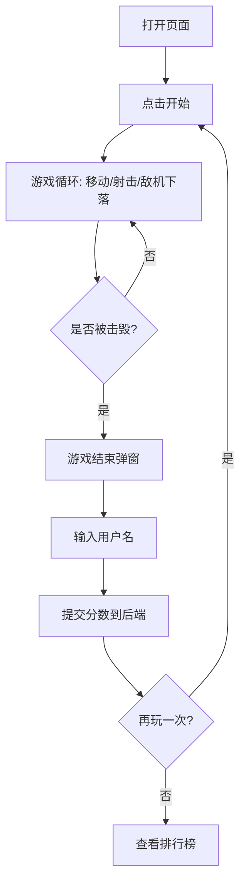

## 1. 产品概述

复古太空弹幕射击网页游戏，玩家驾驶飞船在星空中抵御不断下落的敌机，支持分数上传与全球排行榜。
- 解决问题：提供即开即玩、零安装的浏览器街机射击体验，怀旧像素美学搭配现代流畅手感。
- 目标用户：怀旧街机爱好者、碎片化时间的休闲玩家、追求排行榜竞争的硬核射击玩家。
- 市场价值：以差异化复古视觉与实时排行榜社交驱动留存，轻量全栈架构便于快速部署。

## 2. 核心功能

### 2.1 用户角色
| 角色 | 注册方式 | 核心权限 |
|------|----------|----------|
| 游客玩家 | 无需注册，游戏结束时输入用户名 | 游玩、提交单次分数、查看排行榜 |
| 排行榜访客 | 无需登录 | 浏览 Top 玩家分数榜单 |

### 2.2 功能模块
1. **游戏主界面**：Canvas 游戏画布、HUD（分数/生命/关卡）、开始/暂停、操作说明、敌机生成与弹幕系统。
2. **排行榜界面**：Top 10 玩家分数列表、分数/玩家名/排名、刷新按钮、当前玩家高亮。
3. **游戏结束弹窗**：最终分数展示、用户名输入框、提交按钮、再玩一次、查看排行榜入口。

### 2.3 页面详情
| 页面名称 | 模块名称 | 功能描述 |
|---------|----------|----------|
| 游戏主界面 | Canvas 画布 | 60fps 渲染循环、星空背景滚动、飞船精灵、子弹/敌机/爆炸粒子 |
| 游戏主界面 | HUD | 实时分数、生命值图标、当前关卡、连击数显示 |
| 游戏主界面 | 操作说明 | 方向键移动、空格射击、P 暂停的键位提示 |
| 游戏主界面 | 敌机生成器 | 按关卡难度递增敌机数量、速度、射击频率，多种敌机类型 |
| 排行榜界面 | 分数列表 | Top 10 排名表格，分数降序，刷新按钮拉取最新数据 |
| 游戏结束弹窗 | 分数提交 | 显示最终分数、用户名输入（校验非空长度）、提交到后端 |
| 游戏结束弹窗 | 行动按钮 | 再玩一次重置游戏、查看排行榜跳转 |

## 3. 核心流程

玩家打开页面 → 阅读操作说明 → 点击开始 → 飞船出现，方向键移动、空格射击 → 敌机持续从顶部下落并射击 → 击毁敌机得分、随关卡推进难度提升 → 飞船被击中耗尽生命 → 触发游戏结束 → 弹出输入框填写用户名 → 提交分数到后端写入 MongoDB → 可选择再玩一次或查看排行榜。

## 4. 用户界面设计

### 4.1 设计风格
- **主色调**：深空黑（#05010d）为底，霓虹青（#00f0ff）与品红（#ff2d95）为强调色，荧光黄（#ffe600）用于得分/警示。
- **按钮风格**：复古街机风，描边发光按钮、按下时位移模拟物理按压、悬停辉光放大。
- **字体**：显示字体用像素体 "Press Start 2P"（标题/HUD/分数），正文用 "VT323" 等宽终端体；层级分明。
- **布局风格**：居中 Canvas 画布为主舞台，两侧/顶部 HUD 信息条，底部操作提示；弹窗居中遮罩。
- **图标/emoji**：生命值用像素心形 ♥（CSS 绘制），爆炸用粒子系统，敌机用几何像素造型。

### 4.2 页面设计概述
| 页面名称 | 模块名称 | UI 元素 |
|---------|----------|---------|
| 游戏主界面 | Canvas 画布 | 全黑星空、滚动星层视差、霓虹描边飞船、激光子弹拖尾、扫描线 CRT 滤镜叠加 |
| 游戏主界面 | HUD 顶栏 | 半透明黑条、左侧分数（霓虹青像素字）、中间关卡、右侧像素心形生命 |
| 游戏主界面 | 开始遮罩 | 标题"SPACE RAIDERS"霓虹辉光、开始按钮脉冲动画、键位说明卡片 |
| 排行榜界面 | 分数表格 | 像素边框表格、排名/玩家/分数三列、Top3 金银铜配色、当前玩家行闪烁高亮 |
| 游戏结束弹窗 | 弹窗主体 | 半透明遮罩、像素边框卡片、大号最终分数、用户名输入框（终端光标）、提交/重玩按钮 |

### 4.3 响应式
- 桌面优先设计，Canvas 固定逻辑分辨率（480×720）按窗口等比缩放适配，移动端触屏方向键+射击按钮虚拟手柄，保持竖屏街机比例。

### 4.4 视觉氛围指引
- CRT 复古效果：扫描线叠加、轻微色差、屏幕边缘暗角晕影。
- 动效：飞船引擎尾焰粒子、子弹拖尾、敌机爆炸粒子四散、得分浮动数字、屏幕轻微抖动反馈。
- 音效占位：预留 WebAudio 音效接口（射击/爆炸/被击中），后续可扩展。
