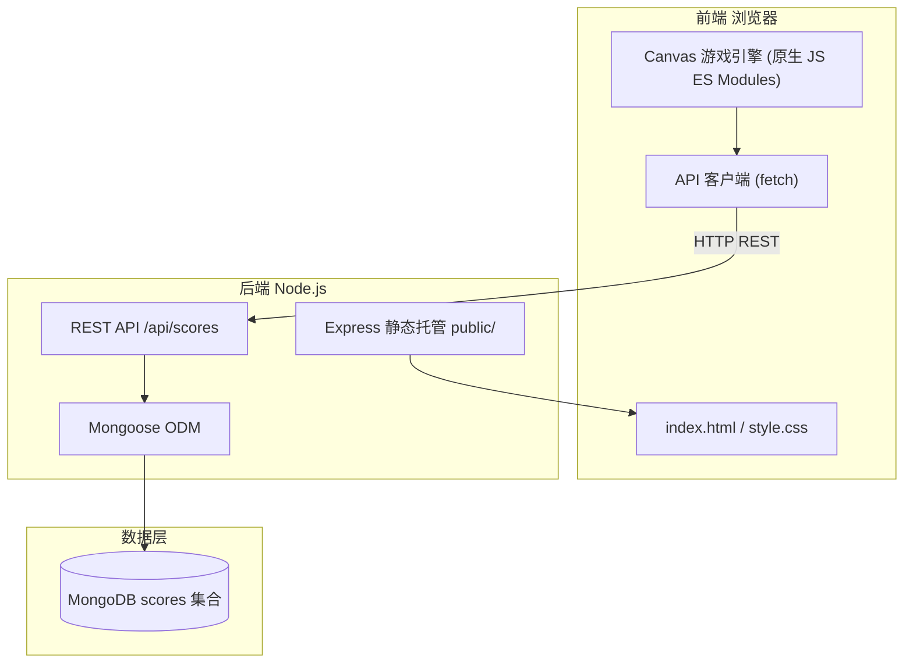
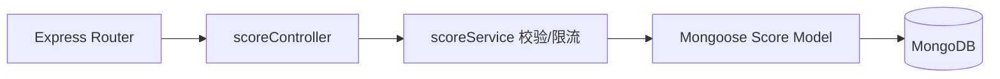
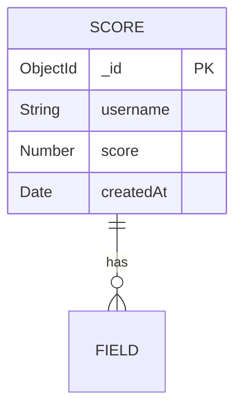

## 1. 架构设计



## 2. 技术说明
- **前端**：HTML5 Canvas + 原生 JavaScript（ES Modules），无框架无构建步骤；游戏引擎自实现 requestAnimationFrame 渲染循环、实体管理、碰撞检测、粒子系统。
- **初始化工具**：无（原生 JS 直接由 Express 托管静态资源）；`npm` 管理后端依赖。
- **后端**：Express@4，同时托管 `public/` 静态前端与 REST API。
- **数据库**：MongoDB（本地或 Atlas），通过 `mongoose@8` 访问；本地开发用 `mongodb://127.0.0.1:27017/space-raiders`，可由 `MONGODB_URI` 环境变量覆盖。
- **环境配置**：`dotenv` 加载 `.env`，`cors` 放开跨域（便于前后端分离调试），`express-rate-limit` 防刷分数提交。

> 说明：用户明确要求前端使用原生 JavaScript + Canvas（而非 React），故架构遵循此约束，前端零构建。

## 3. 路由定义
| 路由 | 用途 |
|------|------|
| `/` | 返回游戏主页面（`public/index.html`） |
| `/api/scores` (GET) | 获取 Top 10 排行榜 |
| `/api/scores` (POST) | 提交玩家分数 |

## 4. API 定义

```typescript
// 提交分数请求
interface SubmitScoreRequest {
  username: string;   // 1-12 字符
  score: number;      // >= 0
}

// 提交分数响应
interface SubmitScoreResponse {
  success: boolean;
  rank: number;       // 该分数在榜单中的排名
}

// 排行榜条目
interface ScoreEntry {
  username: string;
  score: number;
  createdAt: string;  // ISO 时间
}

// 排行榜响应
interface LeaderboardResponse {
  scores: ScoreEntry[]; // Top 10，分数降序
}
```

- **POST /api/scores**：校验 username 长度 1-12、score 非负；写入后返回该分数排名。
- **GET /api/scores**：返回分数降序 Top 10。

## 5. 服务端架构图



## 6. 数据模型

### 6.1 数据模型定义


### 6.2 数据定义语言（Mongoose Schema）
```javascript
// 仅一条 scores 集合，按 score 降序索引加速排行榜查询
const scoreSchema = new Schema({
  username: { type: String, required: true, trim: true, minlength: 1, maxlength: 12 },
  score:    { type: Number, required: true, min: 0 },
  createdAt:{ type: Date, default: Date.now }
});
scoreSchema.index({ score: -1 });
```

## 7. 项目目录结构
```
cv5/
├── public/                 # 前端静态资源（Express 托管）
│   ├── index.html
│   ├── css/style.css
│   └── js/
│       ├── main.js         # 入口：初始化与状态机
│       ├── game.js         # 游戏引擎/渲染循环
│       ├── entities.js     # Player/Enemy/Bullet/Particle 类
│       ├── input.js        # 键盘输入管理
│       └── api.js          # 排行榜 fetch 客户端
├── server/
│   ├── server.js           # Express 入口
│   ├── config.js           # 环境配置
│   ├── models/Score.js     # Mongoose 模型
│   └── routes/scores.js    # 分数路由+校验
├── .env.example
├── package.json
└── .gitignore
```
